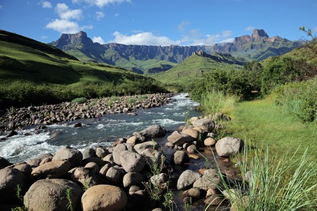
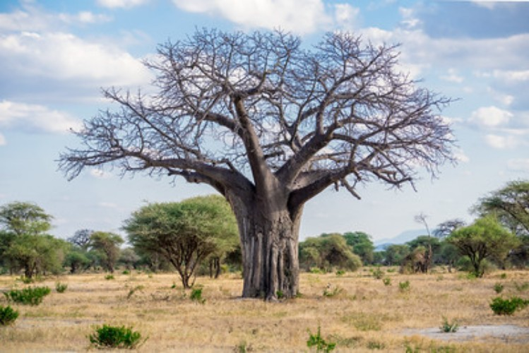
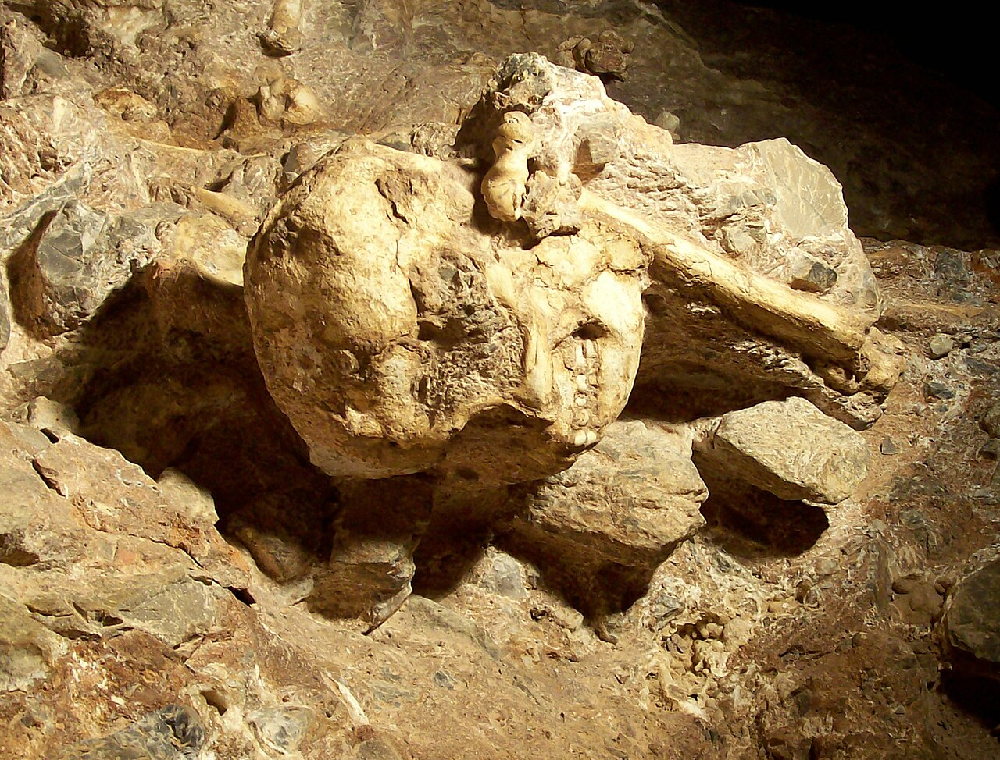

  

    
  

  

    <h1>Pliocene Hominin Dispersal to southern Africa:</h1>
    <h1>Choice or Chance?</h1>
  

  
Modern humans migrated to colder regions out of Africa during the <em>Pleistocene</em> (Out-of-Africa). However, evidence suggests that early hominins already inhabited temperate zones in South Africa millions of years earlier, i.e. during the Pliocene. PLIODIS will explore the possible causes for this pan-African distribution of early hominins and how it may have shaped the course of our evolutionary history. To do so, we will reconstruct the geomorphological changes in the Kalahari/proto-Limpopo basin and the Zambezian region, explore the climatic and vegetation changes in deep time and examine the hominin fossil record against this ecological backdrop.

   
  
<strong>PLIODIS</strong> will tests several hypotheses: that early hominin ranges in East Africa expanded and contracted with changing wet and dry phases; that shifts in dispersal corridors led to intermittent gene flow between eastern African and southern African populations; and that tectonic changes eventually turned the Zambezi River into a significant barrier, leading to the endemism among South African hominins.

  <h2>Three Key Questions</h2>
  

    

      
      <h3>Landscape</h3>
      
How did changes in drainage systems and landscape topography shape conncectivity between eastern and southern Africa, thereby creating/closing potential dispersal corridors between the regions?

    

    

      
      <h3>Environment</h3>
      
What role did climate shifts and vegetation change play in the opening or closing of these potential migration routes?

    

    

      
      <h3>Biology</h3>
      
How did early hominins respond to ecological changes? What was the population dynamics between eastern and southern African hominins (e.g., drift, hybridization, endemism)?

    

  

  <h2>Research Objectives</h2>
  

    <a href="{{ site.baseurl }}/science/#i-geomorphology" class="objective-card">
      
01

      <h3>Geomorphology</h3>
      
Determine geomorphological and palaeoecological changes in the Kalahari/proto-Limpopo basin and Zambezian region during the Plio-Pleistocene

    </a>

    <a href="{{ site.baseurl }}/science/#ii-palaeoclimate-and-palaeoenvironment" class="objective-card">
      
02

      <h3>Palaeoclimate</h3>
      
Create dynamic palaeo-precipitation and palaeo-vegetation models from multiple marine and terrestrial archives

    </a>

    <a href="{{ site.baseurl }}/science/#iii-morphology" class="objective-card">
      
03

      <h3>Morphology</h3>
      
Carry out detailed morphological and functional analyses of hominin and non-hominin fossil remains

    </a>

    <a href="{{ site.baseurl }}/science/#iii-validation-and-integration" class="objective-card">
      
04

      <h3>Integration</h3>
      
Integrate these various datasets to evaluate species diversity and niche partitioning (functional adaptations) in response to ecological changes, appraise the rates of evolutionary changes and the potential impact of gene flow (hybridization), and create dispersal scenarios (palaeobiogeography)

    </a>

  

